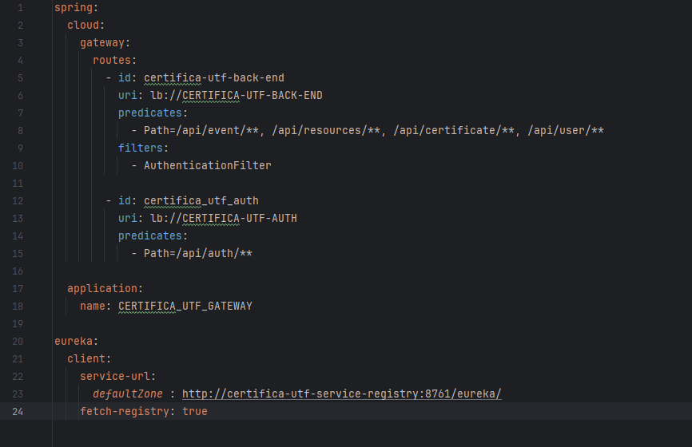

# CertificaUTF Gateway

O gateway é responsável por controlar o tráfego de comunicação

For more details read:

- [Api gateway in spring boot]( https://medium.com/@ankithahjpgowda/api-gateway-in-spring-boot-3ea804003021 )
- [Exploring api gateways with spring boot ]( https://medium.com/@ksaquib/exploring-api-gateways-with-spring-boot-ba00e8a08f50 )

The most important file is <b>application.yml</b>, here is defined predicates and filters

